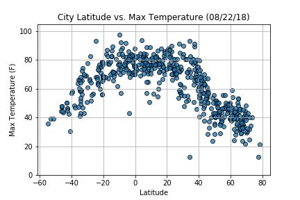
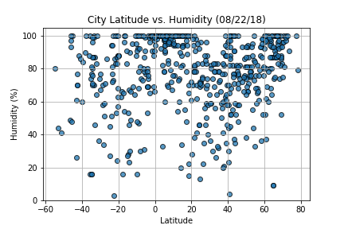
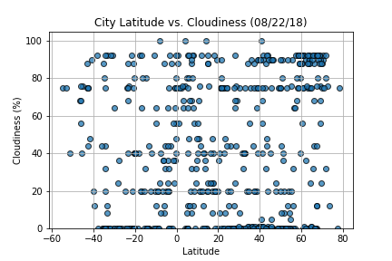
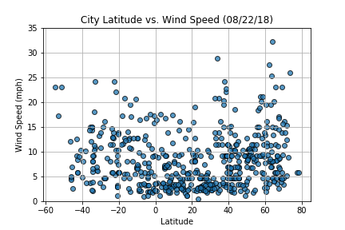

# Weather Data Analysis

This project is for creating a Python script to visualize the weather of 500+ cities across the world of varying distance from the equator, by utilizing a Python library, and the OpenWeatherMap API.

**Objective:**
To build a series of scatter plots to showcase the following relationships:

* Temperature (F) vs. Latitude
* Humidity (%) vs. Latitude
* Cloudiness (%) vs. Latitude
* Wind Speed (mph) vs. Latitude

**Technologies/Framework Used:**
* Python Requests
* APIs
* JSON Traversals

### Analysis
* As expected, the weather becomes significantly warmer as one approaches the equator (0 Deg. Latitude). More interestingly, however, is the fact that the southern hemisphere tends to be warmer this time of year than the northern hemisphere. This may be due to the tilt of the earth.
* There is no strong relationship between latitude and cloudiness. However, it is interesting to see that a strong band of cities sits at 0, 80, and 100% cloudiness.
* There is no strong relationship between latitude and wind speed. However, in northern hemispheres there is a flurry of cities with over 20 mph of wind.

---
<style scoped> .dataframe tbody tr th:only-of-type { vertical-align: middle; }
.dataframe tbody tr th {
    vertical-align: top;
}

.dataframe thead th {
    text-align: right;
}
</style>
**Dependencies:**
```python
# Dependencies and Setup
import matplotlib.pyplot as plt
import pandas as pd
import numpy as np
import requests
import time

# Import API key
from api_keys import api_key

#Incorporated citipy to determine city based on latitude and longitude
from citipy import citipy

# Output File (CSV)
output_data_file = "output_data/cities.csv"

# Range of latitudes and longitudes
lat_range = (-90, 90)
lng_range = (-180, 180)
```

## Generate Cities List


```python
# List for holding lat_lngs and cities
lat_lngs = []
cities = []

# Create a set of random lat and lng combinations
lats = np.random.uniform(low=-90.000, high=90.000, size=1500)
lngs = np.random.uniform(low=-180.000, high=180.000, size=1500)
lat_lngs = zip(lats, lngs)

# Identify nearest city for each lat, lng combination
for lat_lng in lat_lngs:
    city = citipy.nearest_city(lat_lng[0], lat_lng[1]).city_name
    
    # If the city is unique, then add it to a our cities list
    if city not in cities:
        cities.append(city)

# Print the city count to confirm sufficient count
len(cities)
```


    595


```python
 

### Perform API Calls
* Perform a weather check on each city using a series of successive API calls.
* Include a print log of each city as it'sbeing processed (with the city number and city name).


```python
url = "http://api.openweathermap.org/data/2.5/weather?"
units = "imperial"
# query URL
query_url = url + "appid=" + api_key + "&units=" + units + "&q="
```


```python
# Get weather data
print("Beginning Data Retrival")
print("------------------------------")
set_count = 1
record_count = 1
weather_data = {"City":[],"Cloudiness":[],"Country":[],"Date":[],"Humidity":[],"Lat":[],"Lng":[],"Max Temp":[],"Wind Speed": []}
for city in cities:
    weather_response = requests.get(query_url + city)
    weather_response_json = weather_response.json()
    
    if weather_response.status_code == 200:
        weather_data["City"].append(city)
        weather_data["Cloudiness"].append(weather_response_json['clouds']['all'])
        weather_data["Country"].append(weather_response_json['sys']['country'])
        weather_data["Date"].append(weather_response_json['dt'])
        weather_data["Humidity"].append(weather_response_json['main']['humidity'])
        weather_data["Lat"].append(weather_response_json['coord']['lat'])
        weather_data["Lng"].append(weather_response_json['coord']['lon'])
        weather_data["Max Temp"].append(weather_response_json['main']['temp_max'])
        weather_data["Wind Speed"].append(weather_response_json['wind']['speed'])
        if record_count <= 50:
            print(f"Processing Record {record_count} of Set {set_count} | {city}")
            record_count += 1 
        else:
            record_count = 0
            set_count += 1
            print(f"Processing Record {record_count} of Set {set_count} | {city}")
            record_count += 1
    else:
        print("City not found. Skipping...")
print("-------------------------")
print("Data Retrieval Complete")
print("-------------------------")
```

    Beginning Data Retrival
    ------------------------------
    Processing Record 1 of Set 1 | saint-philippe
    Processing Record 2 of Set 1 | busselton
    Processing Record 3 of Set 1 | port hardy
    Processing Record 4 of Set 1 | bunumbu
    City not found. Skipping...
    Processing Record 5 of Set 1 | brae
    Processing Record 6 of Set 1 | jojoima
    City not found. Skipping...
    Processing Record 7 of Set 1 | payakumbuh
    Processing Record 8 of Set 1 | provideniya
    Processing Record 9 of Set 1 | butaritari
    Processing Record 10 of Set 1 | egvekinot
    Processing Record 11 of Set 1 | kodiak
    Processing Record 12 of Set 1 | rikitea
    Processing Record 13 of Set 1 | ushuaia
    Processing Record 14 of Set 1 | sagarejo
    Processing Record 15 of Set 1 | ilulissat
    Processing Record 16 of Set 1 | changping
    Processing Record 17 of Set 1 | hermanus
    Processing Record 18 of Set 1 | atuona
    Processing Record 19 of Set 1 | magadan
    Processing Record 20 of Set 1 | ust-kuyga
    City not found. Skipping...
    Processing Record 21 of Set 1 | touros
    Processing Record 22 of Set 1 | severo-kurilsk
    Processing Record 23 of Set 1 | puerto ayora
    Processing Record 24 of Set 1 | moose factory
    Processing Record 25 of Set 1 | vao
    Processing Record 26 of Set 1 | clyde river
    Processing Record 27 of Set 1 | saint anthony
    Processing Record 28 of Set 1 | tulsa
    Processing Record 29 of Set 1 | ribeira grande
    Processing Record 30 of Set 1 | punta arenas
    Processing Record 31 of Set 1 | salalah
    Processing Record 32 of Set 1 | haines junction
    Processing Record 33 of Set 1 | vila franca do campo
    Processing Record 34 of Set 1 | barrow
    Processing Record 35 of Set 1 | east london
    Processing Record 36 of Set 1 | vostok
    Processing Record 37 of Set 1 | indramayu
    Processing Record 38 of Set 1 | port lincoln
    Processing Record 39 of Set 1 | te anau
    Processing Record 40 of Set 1 | mataura
    Processing Record 41 of Set 1 | saint george
    City not found. Skipping...
    Processing Record 42 of Set 1 | lata
    Processing Record 43 of Set 1 | hobart
    Processing Record 44 of Set 1 | kapaa
    Processing Record 45 of Set 1 | iqaluit
    Processing Record 46 of Set 1 | namatanai
    Processing Record 47 of Set 1 | nabire
    Processing Record 48 of Set 1 | waingapu
    Processing Record 49 of Set 1 | georgetown
    Processing Record 50 of Set 1 | vaini
    Processing Record 0 of Set 2 | tual
    Processing Record 1 of Set 2 | carnarvon
    City not found. Skipping...
    Processing Record 2 of Set 2 | bluff
    Processing Record 3 of Set 2 | narsaq
    Processing Record 4 of Set 2 | saskylakh
    Processing Record 5 of Set 2 | sibu
    Processing Record 6 of Set 2 | northam
    Processing Record 7 of Set 2 | ambanja
    Processing Record 8 of Set 2 | dikson
    City not found. Skipping...
    Processing Record 9 of Set 2 | obo
    Processing Record 10 of Set 2 | pobe
    Processing Record 11 of Set 2 | peniche
    Processing Record 12 of Set 2 | vila velha
    Processing Record 13 of Set 2 | kupang
    Processing Record 14 of Set 2 | port keats
    Processing Record 15 of Set 2 | reading
    Processing Record 16 of Set 2 | chokurdakh
    Processing Record 17 of Set 2 | xuddur
    Processing Record 18 of Set 2 | chiang kham
    Processing Record 19 of Set 2 | peterhead
    Processing Record 20 of Set 2 | katsuura
    Processing Record 21 of Set 2 | khatanga
    Processing Record 22 of Set 2 | tuktoyaktuk
    Processing Record 23 of Set 2 | vardo
    Processing Record 24 of Set 2 | geraldton
    City not found. Skipping...
    Processing Record 25 of Set 2 | tabas
    City not found. Skipping...
    Processing Record 26 of Set 2 | dakar
    Processing Record 27 of Set 2 | jamestown
    Processing Record 28 of Set 2 | quthing
    Processing Record 29 of Set 2 | kindu
    Processing Record 30 of Set 2 | aklavik
    Processing Record 31 of Set 2 | hilo
    City not found. Skipping...
    Processing Record 32 of Set 2 | sitka
    Processing Record 33 of Set 2 | barentu
    Processing Record 34 of Set 2 | matelica
    Processing Record 35 of Set 2 | igarka
    Processing Record 36 of Set 2 | lagoa
    Processing Record 37 of Set 2 | arnprior
    Processing Record 38 of Set 2 | bathsheba
    Processing Record 39 of Set 2 | biak
    Processing Record 40 of Set 2 | portland
    Processing Record 41 of Set 2 | souillac
    Processing Record 42 of Set 2 | moshupa
    Processing Record 43 of Set 2 | guerrero negro
    Processing Record 44 of Set 2 | pevek
    Processing Record 45 of Set 2 | albany
    Processing Record 46 of Set 2 | leh
    Processing Record 47 of Set 2 | cherskiy
    Processing Record 48 of Set 2 | makakilo city
    Processing Record 49 of Set 2 | torbay
    Processing Record 50 of Set 2 | fengzhen
    Processing Record 0 of Set 3 | sur
    Processing Record 1 of Set 3 | jalu
    Processing Record 2 of Set 3 | itarema
    Processing Record 3 of Set 3 | balaipungut
    Processing Record 4 of Set 3 | cairns
    Processing Record 5 of Set 3 | lompoc
    Processing Record 6 of Set 3 | high level
    Processing Record 7 of Set 3 | pizarro
    Processing Record 8 of Set 3 | thompson
    Processing Record 9 of Set 3 | kantunilkin
    Processing Record 10 of Set 3 | kavieng
    Processing Record 11 of Set 3 | marawi
    Processing Record 12 of Set 3 | hofn
    Processing Record 13 of Set 3 | port elizabeth
    Processing Record 14 of Set 3 | mar del plata
    Processing Record 15 of Set 3 | lyuban
    Processing Record 16 of Set 3 | quang ngai
    Processing Record 17 of Set 3 | rio gallegos
    Processing Record 18 of Set 3 | ambikapur
    Processing Record 19 of Set 3 | yellowknife
    Processing Record 20 of Set 3 | kodino
    Processing Record 21 of Set 3 | port alfred
    Processing Record 22 of Set 3 | senno
    Processing Record 23 of Set 3 | qaanaaq
    Processing Record 24 of Set 3 | airai
    Processing Record 25 of Set 3 | bodo
    Processing Record 26 of Set 3 | usinsk
    Processing Record 27 of Set 3 | cape town
    Processing Record 28 of Set 3 | nantucket
    Processing Record 29 of Set 3 | guadalupe y calvo
    Processing Record 30 of Set 3 | jorochito
    Processing Record 31 of Set 3 | nikolskoye
    Processing Record 32 of Set 3 | grand-santi
    Processing Record 33 of Set 3 | sao joao da barra
    Processing Record 34 of Set 3 | areka
    Processing Record 35 of Set 3 | udachnyy
    Processing Record 36 of Set 3 | setermoen
    Processing Record 37 of Set 3 | ornskoldsvik
    Processing Record 38 of Set 3 | iquique
    City not found. Skipping...
    Processing Record 39 of Set 3 | winchester
    Processing Record 40 of Set 3 | vestmannaeyjar
    Processing Record 41 of Set 3 | cidreira
    Processing Record 42 of Set 3 | hithadhoo
    Processing Record 43 of Set 3 | straumen
    Processing Record 44 of Set 3 | soltsy
    Processing Record 45 of Set 3 | muros
    Processing Record 46 of Set 3 | sena madureira
    Processing Record 47 of Set 3 | lebu
    Processing Record 48 of Set 3 | broken hill
    Processing Record 49 of Set 3 | naze
    Processing Record 50 of Set 3 | olga
    Processing Record 0 of Set 4 | fortuna
    Processing Record 1 of Set 4 | usta muhammad
    Processing Record 2 of Set 4 | soyo
    Processing Record 3 of Set 4 | ixtapa
    Processing Record 4 of Set 4 | tessalit
    Processing Record 5 of Set 4 | margate
    Processing Record 6 of Set 4 | karonga
    Processing Record 7 of Set 4 | melfi
    Processing Record 8 of Set 4 | bethel
    Processing Record 9 of Set 4 | ponta do sol
    Processing Record 10 of Set 4 | chuy
    Processing Record 11 of Set 4 | nador
    Processing Record 12 of Set 4 | batemans bay
    Processing Record 13 of Set 4 | hasaki
    Processing Record 14 of Set 4 | milkovo
    Processing Record 15 of Set 4 | lorengau
    Processing Record 16 of Set 4 | moron
    Processing Record 17 of Set 4 | fare
    Processing Record 18 of Set 4 | pavlodar
    Processing Record 19 of Set 4 | minudasht
    Processing Record 20 of Set 4 | nurota
    Processing Record 21 of Set 4 | porto novo
    Processing Record 22 of Set 4 | cacule
    Processing Record 23 of Set 4 | victor harbor
    Processing Record 24 of Set 4 | mandalgovi
    City not found. Skipping...
    Processing Record 25 of Set 4 | lamont
    Processing Record 26 of Set 4 | cabo san lucas
    City not found. Skipping...
    Processing Record 27 of Set 4 | tasiilaq
    Processing Record 28 of Set 4 | new norfolk
    Processing Record 29 of Set 4 | ongandjera
    Processing Record 30 of Set 4 | mozarlandia
    Processing Record 31 of Set 4 | bambous virieux
    Processing Record 32 of Set 4 | yingcheng
    Processing Record 33 of Set 4 | esperance
    Processing Record 34 of Set 4 | turayf
    Processing Record 35 of Set 4 | mildura
    Processing Record 36 of Set 4 | marabba
    Processing Record 37 of Set 4 | kailua
    Processing Record 38 of Set 4 | tiksi
    Processing Record 39 of Set 4 | katherine
    Processing Record 40 of Set 4 | arraial do cabo
    Processing Record 41 of Set 4 | port-gentil
    Processing Record 42 of Set 4 | tilichiki
    Processing Record 43 of Set 4 | henties bay
    Processing Record 44 of Set 4 | college
    Processing Record 45 of Set 4 | casas grandes
    Processing Record 46 of Set 4 | jalpa
    City not found. Skipping...
    Processing Record 47 of Set 4 | mattru
    Processing Record 48 of Set 4 | wasilla
    Processing Record 49 of Set 4 | derzhavinsk
    Processing Record 50 of Set 4 | schio
    Processing Record 0 of Set 5 | faanui
    Processing Record 1 of Set 5 | jishou
    Processing Record 2 of Set 5 | atbasar
    Processing Record 3 of Set 5 | shimoda
    Processing Record 4 of Set 5 | bredasdorp
    Processing Record 5 of Set 5 | tuatapere
    Processing Record 6 of Set 5 | staraya toropa
    Processing Record 7 of Set 5 | weligama
    Processing Record 8 of Set 5 | tokonou
    Processing Record 9 of Set 5 | emerald
    Processing Record 10 of Set 5 | kamalpur
    Processing Record 11 of Set 5 | agua verde
    Processing Record 12 of Set 5 | tabuk
    Processing Record 13 of Set 5 | pacific grove
    Processing Record 14 of Set 5 | calama
    Processing Record 15 of Set 5 | kota
    Processing Record 16 of Set 5 | ubinskoye
    Processing Record 17 of Set 5 | ureshino
    Processing Record 18 of Set 5 | benguela
    Processing Record 19 of Set 5 | goulburn
    Processing Record 20 of Set 5 | sioux lookout
    Processing Record 21 of Set 5 | norman wells
    Processing Record 22 of Set 5 | rumphi
    Processing Record 23 of Set 5 | castro
    Processing Record 24 of Set 5 | camacha
    Processing Record 25 of Set 5 | pringsewu
    Processing Record 26 of Set 5 | avarua
    Processing Record 27 of Set 5 | nanchang
    Processing Record 28 of Set 5 | tinaquillo
    Processing Record 29 of Set 5 | yining
    Processing Record 30 of Set 5 | hirara
    Processing Record 31 of Set 5 | harper
    Processing Record 32 of Set 5 | taloqan
    City not found. Skipping...
    Processing Record 33 of Set 5 | road town
    City not found. Skipping...
    Processing Record 34 of Set 5 | dicabisagan
    City not found. Skipping...
    Processing Record 35 of Set 5 | det udom
    Processing Record 36 of Set 5 | shache
    Processing Record 37 of Set 5 | kirakira
    Processing Record 38 of Set 5 | kaitangata
    Processing Record 39 of Set 5 | pundaguitan
    Processing Record 40 of Set 5 | harstad
    Processing Record 41 of Set 5 | richards bay
    Processing Record 42 of Set 5 | cayenne
    Processing Record 43 of Set 5 | palmer
    Processing Record 44 of Set 5 | pandharpur
    City not found. Skipping...
    Processing Record 45 of Set 5 | leningradskiy
    City not found. Skipping...
    Processing Record 46 of Set 5 | sao filipe
    Processing Record 47 of Set 5 | knarvik
    Processing Record 48 of Set 5 | mahina
    Processing Record 49 of Set 5 | nanortalik
    Processing Record 50 of Set 5 | elizabeth city
    City not found. Skipping...
    Processing Record 0 of Set 6 | palora
    Processing Record 1 of Set 6 | yerbogachen
    Processing Record 2 of Set 6 | barguzin
    Processing Record 3 of Set 6 | adjumani
    Processing Record 4 of Set 6 | mahebourg
    Processing Record 5 of Set 6 | brazzaville
    Processing Record 6 of Set 6 | marzuq
    Processing Record 7 of Set 6 | oksfjord
    Processing Record 8 of Set 6 | upernavik
    Processing Record 9 of Set 6 | tooele
    City not found. Skipping...
    City not found. Skipping...
    Processing Record 10 of Set 6 | saint-pierre
    Processing Record 11 of Set 6 | coahuayana
    Processing Record 12 of Set 6 | dalvik
    City not found. Skipping...
    Processing Record 13 of Set 6 | labytnangi
    Processing Record 14 of Set 6 | jucurutu
    Processing Record 15 of Set 6 | gizo
    Processing Record 16 of Set 6 | samarai
    City not found. Skipping...
    Processing Record 17 of Set 6 | boden
    Processing Record 18 of Set 6 | cockburn town
    Processing Record 19 of Set 6 | kavaratti
    Processing Record 20 of Set 6 | selfoss
    Processing Record 21 of Set 6 | besuki
    City not found. Skipping...
    Processing Record 22 of Set 6 | vuktyl
    City not found. Skipping...
    Processing Record 23 of Set 6 | port blair
    Processing Record 24 of Set 6 | nueva helvecia
    Processing Record 25 of Set 6 | trincomalee
    Processing Record 26 of Set 6 | mount isa
    Processing Record 27 of Set 6 | tadine
    Processing Record 28 of Set 6 | kalemie
    Processing Record 29 of Set 6 | miram shah
    Processing Record 30 of Set 6 | sheridan
    City not found. Skipping...
    Processing Record 31 of Set 6 | mackay
    Processing Record 32 of Set 6 | fairbanks
    City not found. Skipping...
    Processing Record 33 of Set 6 | pontianak
    Processing Record 34 of Set 6 | mantua
    Processing Record 35 of Set 6 | helena
    Processing Record 36 of Set 6 | koulamoutou
    Processing Record 37 of Set 6 | victoria
    Processing Record 38 of Set 6 | chapais
    Processing Record 39 of Set 6 | sao gabriel da cachoeira
    Processing Record 40 of Set 6 | praia da vitoria
    City not found. Skipping...
    Processing Record 41 of Set 6 | lakes entrance
    Processing Record 42 of Set 6 | ahipara
    City not found. Skipping...
    Processing Record 43 of Set 6 | mocuba
    Processing Record 44 of Set 6 | arica
    City not found. Skipping...
    Processing Record 45 of Set 6 | erenhot
    Processing Record 46 of Set 6 | veraval
    Processing Record 47 of Set 6 | yondo
    Processing Record 48 of Set 6 | cruzeiro do sul
    Processing Record 49 of Set 6 | ancud
    City not found. Skipping...
    Processing Record 50 of Set 6 | banda aceh
    Processing Record 0 of Set 7 | nexo
    Processing Record 1 of Set 7 | coquimbo
    Processing Record 2 of Set 7 | naryan-mar
    City not found. Skipping...
    Processing Record 3 of Set 7 | ashoknagar
    Processing Record 4 of Set 7 | bandarbeyla
    Processing Record 5 of Set 7 | el tarra
    City not found. Skipping...
    Processing Record 6 of Set 7 | rawson
    Processing Record 7 of Set 7 | saint-augustin
    Processing Record 8 of Set 7 | aksum
    Processing Record 9 of Set 7 | volgorechensk
    Processing Record 10 of Set 7 | pokhara
    Processing Record 11 of Set 7 | gryazovets
    Processing Record 12 of Set 7 | sigulda
    Processing Record 13 of Set 7 | antofagasta
    Processing Record 14 of Set 7 | ostrovnoy
    Processing Record 15 of Set 7 | castelnau-le-lez
    Processing Record 16 of Set 7 | kropotkin
    Processing Record 17 of Set 7 | marfino
    Processing Record 18 of Set 7 | nuuk
    Processing Record 19 of Set 7 | catuday
    Processing Record 20 of Set 7 | lodeynoye pole
    Processing Record 21 of Set 7 | kaohsiung
    Processing Record 22 of Set 7 | payo
    Processing Record 23 of Set 7 | kansk
    City not found. Skipping...
    Processing Record 24 of Set 7 | tacuarembo
    Processing Record 25 of Set 7 | sabha
    Processing Record 26 of Set 7 | matoury
    Processing Record 27 of Set 7 | san carlos de bariloche
    Processing Record 28 of Set 7 | petropavlovsk-kamchatskiy
    Processing Record 29 of Set 7 | faya
    City not found. Skipping...
    Processing Record 30 of Set 7 | puerto del rosario
    Processing Record 31 of Set 7 | umm lajj
    Processing Record 32 of Set 7 | bahir dar
    City not found. Skipping...
    Processing Record 33 of Set 7 | tshikapa
    Processing Record 34 of Set 7 | xuanzhou
    Processing Record 35 of Set 7 | pontian kecil
    Processing Record 36 of Set 7 | itoman
    Processing Record 37 of Set 7 | seymchan
    Processing Record 38 of Set 7 | guarapari
    Processing Record 39 of Set 7 | iskateley
    Processing Record 40 of Set 7 | luderitz
    Processing Record 41 of Set 7 | takoradi
    Processing Record 42 of Set 7 | san cristobal
    Processing Record 43 of Set 7 | sabang
    Processing Record 44 of Set 7 | praia
    City not found. Skipping...
    Processing Record 45 of Set 7 | karratha
    City not found. Skipping...
    Processing Record 46 of Set 7 | biala podlaska
    Processing Record 47 of Set 7 | roebourne
    Processing Record 48 of Set 7 | trofors
    Processing Record 49 of Set 7 | vysokogornyy
    Processing Record 50 of Set 7 | tezu
    Processing Record 0 of Set 8 | nhulunbuy
    Processing Record 1 of Set 8 | ngaoundere
    Processing Record 2 of Set 8 | bulgan
    Processing Record 3 of Set 8 | rio grande
    Processing Record 4 of Set 8 | barcelos
    Processing Record 5 of Set 8 | deputatskiy
    Processing Record 6 of Set 8 | newport
    Processing Record 7 of Set 8 | cedar city
    City not found. Skipping...
    Processing Record 8 of Set 8 | half moon bay
    Processing Record 9 of Set 8 | lishui
    City not found. Skipping...
    Processing Record 10 of Set 8 | plast
    Processing Record 11 of Set 8 | gongzhuling
    Processing Record 12 of Set 8 | ambilobe
    City not found. Skipping...
    Processing Record 13 of Set 8 | bud
    Processing Record 14 of Set 8 | san quintin
    Processing Record 15 of Set 8 | grindavik
    Processing Record 16 of Set 8 | sobolevo
    Processing Record 17 of Set 8 | klaksvik
    Processing Record 18 of Set 8 | koumac
    Processing Record 19 of Set 8 | mastic beach
    Processing Record 20 of Set 8 | gravdal
    Processing Record 21 of Set 8 | gornopravdinsk
    Processing Record 22 of Set 8 | vallenar
    Processing Record 23 of Set 8 | naifaru
    Processing Record 24 of Set 8 | kalabo
    Processing Record 25 of Set 8 | colares
    Processing Record 26 of Set 8 | beringovskiy
    Processing Record 27 of Set 8 | coari
    Processing Record 28 of Set 8 | lavrentiya
    Processing Record 29 of Set 8 | dolores
    Processing Record 30 of Set 8 | thinadhoo
    City not found. Skipping...
    City not found. Skipping...
    Processing Record 31 of Set 8 | columbia
    Processing Record 32 of Set 8 | merauke
    Processing Record 33 of Set 8 | grobina
    Processing Record 34 of Set 8 | grand gaube
    City not found. Skipping...
    Processing Record 35 of Set 8 | ati
    Processing Record 36 of Set 8 | krasnokamensk
    Processing Record 37 of Set 8 | goderich
    Processing Record 38 of Set 8 | khawhai
    Processing Record 39 of Set 8 | beatrice
    Processing Record 40 of Set 8 | chumikan
    Processing Record 41 of Set 8 | kieta
    Processing Record 42 of Set 8 | zaraza
    Processing Record 43 of Set 8 | pytalovo
    City not found. Skipping...
    Processing Record 44 of Set 8 | rovaniemi
    Processing Record 45 of Set 8 | krasnaya gora
    Processing Record 46 of Set 8 | lamu
    Processing Record 47 of Set 8 | winnemucca
    Processing Record 48 of Set 8 | buchanan
    Processing Record 49 of Set 8 | omboue
    Processing Record 50 of Set 8 | reinosa
    Processing Record 0 of Set 9 | canico
    Processing Record 1 of Set 9 | bubaque
    Processing Record 2 of Set 9 | riyadh
    Processing Record 3 of Set 9 | serra talhada
    Processing Record 4 of Set 9 | kudahuvadhoo
    City not found. Skipping...
    Processing Record 5 of Set 9 | srednekolymsk
    Processing Record 6 of Set 9 | upington
    Processing Record 7 of Set 9 | bytca
    Processing Record 8 of Set 9 | kutum
    City not found. Skipping...
    Processing Record 9 of Set 9 | japura
    Processing Record 10 of Set 9 | san miniato
    Processing Record 11 of Set 9 | hamilton
    Processing Record 12 of Set 9 | aurangabad
    Processing Record 13 of Set 9 | bograd
    Processing Record 14 of Set 9 | ukiah
    Processing Record 15 of Set 9 | mookane
    Processing Record 16 of Set 9 | paraiso
    Processing Record 17 of Set 9 | hastings
    Processing Record 18 of Set 9 | dalby
    Processing Record 19 of Set 9 | buraydah
    Processing Record 20 of Set 9 | les cayes
    Processing Record 21 of Set 9 | tongren
    City not found. Skipping...
    Processing Record 22 of Set 9 | porbandar
    Processing Record 23 of Set 9 | mumford
    Processing Record 24 of Set 9 | aksha
    Processing Record 25 of Set 9 | le port
    Processing Record 26 of Set 9 | hurricane
    City not found. Skipping...
    Processing Record 27 of Set 9 | aden
    Processing Record 28 of Set 9 | conceicao do araguaia
    Processing Record 29 of Set 9 | kankon
    Processing Record 30 of Set 9 | husavik
    Processing Record 31 of Set 9 | strezhevoy
    Processing Record 32 of Set 9 | saldanha
    Processing Record 33 of Set 9 | atambua
    Processing Record 34 of Set 9 | kandiaro
    Processing Record 35 of Set 9 | gushi
    City not found. Skipping...
    Processing Record 36 of Set 9 | verkhnyaya inta
    Processing Record 37 of Set 9 | sept-iles
    City not found. Skipping...
    Processing Record 38 of Set 9 | cabedelo
    Processing Record 39 of Set 9 | salta
    Processing Record 40 of Set 9 | lasa
    Processing Record 41 of Set 9 | wahiawa
    Processing Record 42 of Set 9 | yar-sale
    Processing Record 43 of Set 9 | kastamonu
    Processing Record 44 of Set 9 | newcastle
    Processing Record 45 of Set 9 | lac du bonnet
    Processing Record 46 of Set 9 | iracoubo
    Processing Record 47 of Set 9 | folldal
    Processing Record 48 of Set 9 | verkhoyansk
    City not found. Skipping...
    Processing Record 49 of Set 9 | flinders
    Processing Record 50 of Set 9 | san ramon
    Processing Record 0 of Set 10 | bilibino
    Processing Record 1 of Set 10 | gilbues
    Processing Record 2 of Set 10 | talnakh
    City not found. Skipping...
    Processing Record 3 of Set 10 | anzio
    Processing Record 4 of Set 10 | mehamn
    Processing Record 5 of Set 10 | kloulklubed
    Processing Record 6 of Set 10 | juxtlahuaca
    City not found. Skipping...
    Processing Record 7 of Set 10 | porosozero
    Processing Record 8 of Set 10 | bonthe
    Processing Record 9 of Set 10 | gold coast
    Processing Record 10 of Set 10 | constitucion
    Processing Record 11 of Set 10 | cam ranh
    Processing Record 12 of Set 10 | waipawa
    Processing Record 13 of Set 10 | bissora
    Processing Record 14 of Set 10 | tempio pausania
    Processing Record 15 of Set 10 | santa isabel do rio negro
    Processing Record 16 of Set 10 | papetoai
    Processing Record 17 of Set 10 | nemuro
    Processing Record 18 of Set 10 | bilma
    Processing Record 19 of Set 10 | zhezkazgan
    Processing Record 20 of Set 10 | mahajanga
    Processing Record 21 of Set 10 | pierre
    Processing Record 22 of Set 10 | kununurra
    Processing Record 23 of Set 10 | makamba
    City not found. Skipping...
    Processing Record 24 of Set 10 | belorechensk
    Processing Record 25 of Set 10 | longyearbyen
    Processing Record 26 of Set 10 | oltedal
    Processing Record 27 of Set 10 | san fernando
    Processing Record 28 of Set 10 | liwale
    Processing Record 29 of Set 10 | kargasok
    Processing Record 30 of Set 10 | anadyr
    City not found. Skipping...
    Processing Record 31 of Set 10 | champerico
    Processing Record 32 of Set 10 | biritiba-mirim
    Processing Record 33 of Set 10 | iquitos
    City not found. Skipping...
    Processing Record 34 of Set 10 | coihaique
    Processing Record 35 of Set 10 | paralimni
    Processing Record 36 of Set 10 | harwich
    Processing Record 37 of Set 10 | fershampenuaz
    Processing Record 38 of Set 10 | nome
    Processing Record 39 of Set 10 | laguna
    Processing Record 40 of Set 10 | pimentel
    Processing Record 41 of Set 10 | boffa
    City not found. Skipping...
    Processing Record 42 of Set 10 | cap malheureux
    Processing Record 43 of Set 10 | hauterive
    Processing Record 44 of Set 10 | mangrol
    Processing Record 45 of Set 10 | salekhard
    Processing Record 46 of Set 10 | smithers
    Processing Record 47 of Set 10 | hambantota
    Processing Record 48 of Set 10 | dobsina
    Processing Record 49 of Set 10 | leticia
    Processing Record 50 of Set 10 | pisco
    Processing Record 0 of Set 11 | komsomolskiy
    Processing Record 1 of Set 11 | turbat
    Processing Record 2 of Set 11 | luga
    Processing Record 3 of Set 11 | ericeira
    Processing Record 4 of Set 11 | samsun
    Processing Record 5 of Set 11 | nizwa
    Processing Record 6 of Set 11 | meulaboh
    Processing Record 7 of Set 11 | annapolis
    City not found. Skipping...
    Processing Record 8 of Set 11 | serenje
    Processing Record 9 of Set 11 | port hawkesbury
    City not found. Skipping...
    City not found. Skipping...
    City not found. Skipping...
    Processing Record 10 of Set 11 | pachino
    Processing Record 11 of Set 11 | carinhanha
    City not found. Skipping...
    Processing Record 12 of Set 11 | celestun
    Processing Record 13 of Set 11 | rocha
    Processing Record 14 of Set 11 | broome
    City not found. Skipping...
    Processing Record 15 of Set 11 | aripuana
    Processing Record 16 of Set 11 | karatau
    Processing Record 17 of Set 11 | phan thiet
    Processing Record 18 of Set 11 | morondava
    Processing Record 19 of Set 11 | hongjiang
    Processing Record 20 of Set 11 | jinzhou
    Processing Record 21 of Set 11 | amanganj
    -------------------------
    Data Retrieval Complete
    -------------------------
    

### Convert Raw Data to DataFrame
* Export the city data into a .csv.
* Display the DataFrame


```python
weather_df = pd.DataFrame(weather_data)
weather_df.head()
```


<div>
<style scoped>
    .dataframe tbody tr th:only-of-type {
        vertical-align: middle;
    }

    .dataframe tbody tr th {
        vertical-align: top;
    }

    .dataframe thead th {
        text-align: right;
    }
</style>
<table border="1" class="dataframe">
  <thead>
    <tr style="text-align: right;">
      <th></th>
      <th>City</th>
      <th>Cloudiness</th>
      <th>Country</th>
      <th>Date</th>
      <th>Humidity</th>
      <th>Lat</th>
      <th>Lng</th>
      <th>Max Temp</th>
      <th>Wind Speed</th>
    </tr>
  </thead>
  <tbody>
    <tr>
      <th>0</th>
      <td>saint-philippe</td>
      <td>90</td>
      <td>CA</td>
      <td>1538344500</td>
      <td>78</td>
      <td>45.36</td>
      <td>-73.48</td>
      <td>53.60</td>
      <td>12.12</td>
    </tr>
    <tr>
      <th>1</th>
      <td>busselton</td>
      <td>12</td>
      <td>AU</td>
      <td>1538345409</td>
      <td>100</td>
      <td>-33.64</td>
      <td>115.35</td>
      <td>56.15</td>
      <td>18.05</td>
    </tr>
    <tr>
      <th>2</th>
      <td>port hardy</td>
      <td>90</td>
      <td>CA</td>
      <td>1538342040</td>
      <td>93</td>
      <td>50.70</td>
      <td>-127.42</td>
      <td>51.80</td>
      <td>10.29</td>
    </tr>
    <tr>
      <th>3</th>
      <td>bunumbu</td>
      <td>92</td>
      <td>SL</td>
      <td>1538345712</td>
      <td>100</td>
      <td>7.96</td>
      <td>-11.73</td>
      <td>72.44</td>
      <td>2.84</td>
    </tr>
    <tr>
      <th>4</th>
      <td>brae</td>
      <td>56</td>
      <td>GB</td>
      <td>1538344200</td>
      <td>52</td>
      <td>60.40</td>
      <td>-1.35</td>
      <td>42.80</td>
      <td>19.46</td>
    </tr>
  </tbody>
</table>
</div>


```python
# Exporting the city data into csv
weather_df.to_csv('weather_data.csv', encoding='utf-8', index=False)
```

### Plotting the Data
* Use proper labeling of the plots using plot titles (including date of analysis) and axes labels.
* Save the plotted figures as .pngs.

#### Latitude vs. Temperature Plot


```python
# Scatter plot
plt.scatter(weather_df["Lat"],weather_df["Max Temp"], marker="o", alpha=0.75, edgecolor="black")
plt.title("City Latitude vs. Max Temperature (08/22/18)")
plt.xlabel("Latitude")
plt.ylabel("Max Temperature (F)")
plt.ylim(0,105)
plt.grid(True)

plt.savefig("LatVsTemp.png")
plt.show()
```





#### Latitude vs. Humidity Plot


```python
# Scatter plot
plt.scatter(weather_df["Lat"],weather_df["Humidity"], marker="o", alpha=0.75, edgecolor="black")
plt.title("City Latitude vs. Humidity (08/22/18)")
plt.xlabel("Latitude")
plt.ylabel("Humidity (%)")
plt.ylim(0,105)
plt.grid(True)

plt.savefig("LatVsHumidity.png")
plt.show()
```





#### Latitude vs. Cloudiness Plot


```python
# Scatter plot
plt.scatter(weather_df["Lat"],weather_df["Cloudiness"], marker="o", alpha=0.75, edgecolor="black")
plt.title("City Latitude vs. Cloudiness (08/22/18)")
plt.xlabel("Latitude")
plt.ylabel("Cloudiness (%)")
plt.ylim(0,105)
plt.grid(True)

plt.savefig("LatVsCloudiness.png")
plt.show()
```





#### Latitude vs. Wind Speed Plot


```python
# Scatter plot
plt.scatter(weather_df["Lat"],weather_df["Wind Speed"], marker="o", alpha=0.75, edgecolor="black")
plt.title("City Latitude vs. Wind Speed (08/22/18)")
plt.xlabel("Latitude")
plt.ylabel("Wind Speed (mph)")
plt.ylim(0,35)
plt.grid(True)

plt.savefig("LatVsWindSpeed.png")
plt.show()
```




